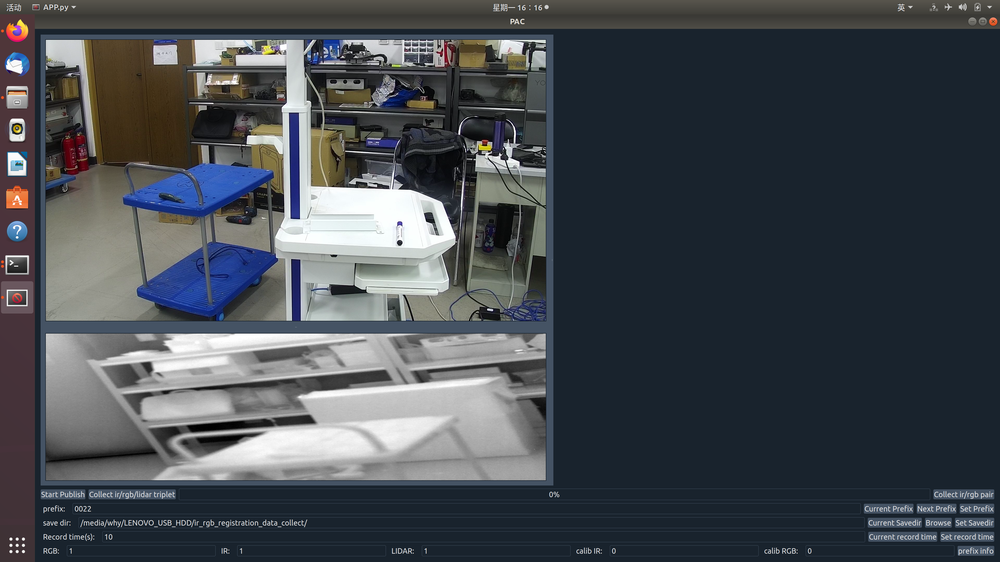
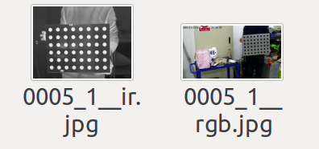
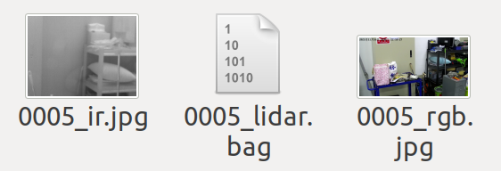

# 多模数据采集及处理软件系统

## 一、 动机

硕士毕业设计需要将Livox Horizon激光雷达、FLIR A615热红外相机、hikvision可见光网络相机融合成多模传感器，搭建多模数据采集及处理软硬件平台，给下游多传感器任务提供支持。本仓库实现多模数据采集及处理软件系统。

由于三款传感器中热红外相机和可见光相机均不支持硬触发，无法实现传感器同步。因此该软件系统目前仅解决固定相机拍摄固定场景的数据采集及处理问题，不面向位姿连续变化任务(e.g., SLAM)或场景中存在动态物体任务。

## 二、简介

### 1. 开发环境、开发语言及软件依赖

1. Linux Ubuntu 18.04
2. C++/python/Shell
3. ROS melodic

### 2. 软件简介

技术上使用C++开发功能内核，用python PyQt开发软件界面，用界面控件和Shell脚本调用功能内核。软件系统的主窗口界面如下所示。

<h6 align="center">软件主界面</h6>

软件分成三个子模块(PCP)：

1. 数据发布子模块(publish data): 统一不同传感器SDK，控制前端传感器发布数据并进行传感器基本参数设置。
2. 数据收集子模块(collect data): 从前端发布数据流中截取数据保存至本地，具有保存IR/RGB/LIDAR三元数据和IR/RGB二元数据两种模式。
3. 数据处理子模块(process data): 包括计算热红外相机-可见光相机的内外参数(单目标定、立体标定)，将激光雷达点云投影至图像上获得热红外-可见光图像的2D-2D匹配点对。

<h6 align="center">流程图(白色框代表节点或节点簇)</h6>

<h6 align="center">IR/RGB二元数据(左)和IR/RGB/LIDAR三元数据(右)</h6>

## 三、使用方法

由于软件内核采用C++编写ROS节点，外部使用python封装了一个界面。因此软件具有命令行调用和软件界面调用两种方式，具体见[使用说明](./supplement.md)。

