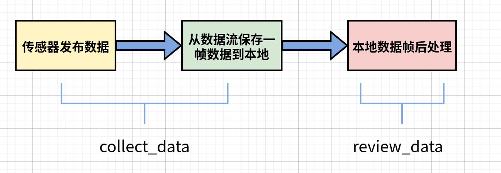

# publish-and-record-multi-sensors

## 一、Motivation

本仓库不面向截取整段数据流任务(比如SLAM)，而面向多源传感器数据流中，截取部分数据的任务。比如非重复扫描固态激光雷达结合可见光图像的三维重建，一帧数据包括固定位姿下10s的积分点云以及一帧可见光图像。整个处理过程可分为以下三步：


<p align="center"></p>

<h6 align="center">流程图</h6>


## 二、命令行使用方法

launch文件中具有**两个关键参数**：

1. 保存路径`save_dir`
2. 文件前缀`prefix`

其中`prefix`范围为[0001-9999]，在收集数据时(1帧rgb，1帧ir，若干s点云)，前缀须人为**向后移动**，不然为覆盖。

在收集对应位姿的标定数据(1帧rgb，1帧ir)时，会引入额外的子前缀 e.g., 0001_1__，但这个标号不需要设置，每次子前缀标号**会自动搜索不覆盖前面数据**。


### 1. 发布数据

```
roslaunch collect_data publish_data.launch
```

### 2. 记录数据

##### 2.1 更改launch文件

**备注:**更改collect_data.launch中的文件保存路径，collect_calib.launch中的文件前缀

```
python3 modify_name.py
```

##### 2.2 抓取激光雷达、可见光、热红外数据

```
roslaunch collect_data collect_data.launch
```

##### 2.3 抓取可见光、热红外数据(用来标定热红外、可见光相机外参)

```
roslaunch collect_data collect_calib.launch
```


## 三、客户端使用方法

````
pip install catkin-tools
pip install rospkg defusedxml
````

客户端大体上是对以上命令行的封装，


## 四、参考资料

[1] [python中调用launch文件](https://blog.csdn.net/bluewhalerobot/article/details/80952751)

[2] [python3运行ROS节点](https://blog.csdn.net/heroacool/article/details/118497979)

[3] [PyQT5订阅图像节点](https://blog.csdn.net/huoxingrenhdh/article/details/116753581)

[4] [Ros melodic python3环境解决cv_bridge问题](https://blog.csdn.net/weixin_42675603/article/details/107785376)

**备注:**`cv_bridge`是将image_msg转opencv image的库，但在python3中存在问题，需要重新编译(还是不行。。。)。

[5] [用自定义数据类型解决cv_bridge问题](https://blog.csdn.net/lizhiyuanbest/article/details/108022588)

[6] [发布和订阅自定义msg数组](https://blog.csdn.net/weixin_30847939/article/details/99386250?utm_medium=distribute.pc_relevant.none-task-blog-2~default~baidujs_baidulandingword~default-0.no_search_link&spm=1001.2101.3001.4242.1&utm_relevant_index=3)

[7] [opencv-pyqt5冲突](https://stackoverflow.com/questions/63903441/python3-importerror-lib-x86-64-linux-gnu-libqt5core-so-5-version-qt-5-15-n)

[8] [opencv-pyqt5冲突2](https://blog.csdn.net/qq_36917144/article/details/111197041#commentBox)

装`opencv-contrib-python-headless`可以解决冲突

