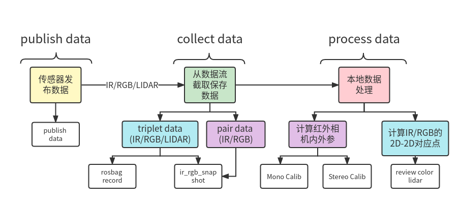
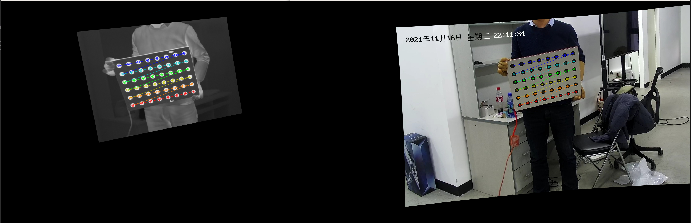
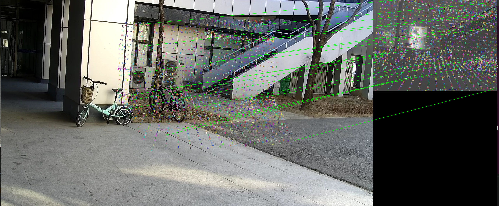
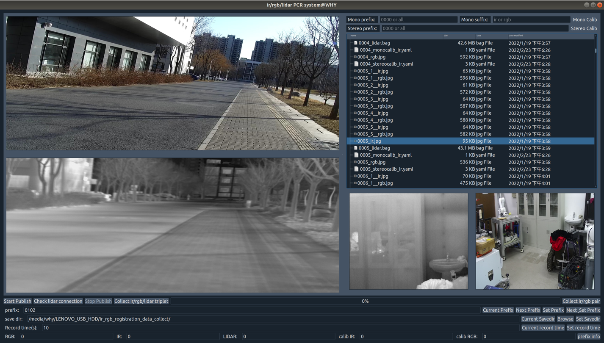

# publish-collect-review-multi-sensors

## 一、Motivation

本仓库不面向截取整段数据流（位姿连续变化）任务(比如SLAM)，而面向多源传感器数据流中，截取部分数据(位姿非连续变化)的任务。比如非重复扫描固态激光雷达结合可见光图像的三维重建，一帧数据包括固定位姿下10s的积分点云以及一帧可见光图像。整个处理过程可分为以下三步：


<p align="center"></p>

<h6 align="center">流程图(白色框代表节点或节点簇)</h6>

其中**pair data**形式为IR/RGB图像对，是当前场景下红外标定版在IR/RGB中的图像，一个场景拍三张以上，用来标定红外内参和红外与可见光相机的外参。**triplet data**形式除IR/RGB图像对外，还包括激光雷达rosbag数据包。 

<p align="center"></p>


<h6 align="center">pair数据(左)和triplet数据(右)</h6>


## 二、命令行使用方法
### 1. 文件说明以及设备调试经验

#### 1.1 文件说明
launch文件中具有**两个关键参数**：

1. 保存路径`save_dir`
2. 文件前缀`prefix`
3. 文件后缀`suffix`（包括ir、rgb、ir_resize，用来标识文件）

其中`prefix`范围为[0001-9999]，在收集数据时(1帧rgb，1帧ir，若干秒点云)，每次收集数据前前缀**需人为向后移动**，不然为覆盖旧数据。在收集标定数据(1帧rgb，1帧ir)时，会引入额外的子前缀 e.g., 0001_1__，子前缀不需要设置，**会自动搜索不覆盖前面数据**。

#### 1.2 设备调试经验

1. FLIR无法接收数据
    查看FLIR设备号: `ls -ltrh /dev/video*`
    ubuntu USB设备号一般为从零开始依次累加，但多个设备每次开机后**设备号不固定**，应该重启后再接FLIR USB。

2. 找不到device 4：之前客户端进程没有关掉，因此cv2.VideoCapture占用着硬件设备资源，导致新的进程无法使用。

    ```
    ps -aux |grep python3 ： 查看进程号
    sudo kill -9 xxx： 关闭xxx进程号
    ```

    

3. HIKVISION无法接收数据
    网络连接问题，需要重新打开、关闭网络（网络->PCI以太网）。或者重启

### 2. 发布数据

```
roslaunch collect_data publish_data.launch
```

### 3. 记录数据

##### 3.1 更改launch文件

**备注:**更改collect_data.launch中的文件保存路径，collect_calib.launch中的文件前缀

```
python3 modify_name.py
```

##### 3.2 抓取激光雷达、可见光、热红外数据

```
roslaunch collect_data collect_data.launch
```

##### 3.3 抓取可见光、热红外数据(用来标定热红外、可见光相机外参)

```
roslaunch collect_data collect_calib.launch
```


### 4. 回顾数据

#### 4.1 单目标定

e.g., 对collect_data.launch中save_dir下前缀为0000，后缀为ir的图像进行单目标定。若遍历所有文件则将0000替换为`all`

```
python3 ./mono_calib.py 0000 ir
```

#### 4.2 立体标定

e.g., 对collect_data.launch中save_dir下前缀为0000的ir/rgb图像对进行立体标定计算外参。若遍历所有文件则将0000替换为`all`

```
python3 ./stereo_calib.py 0000
```

<p align="center"></p>

<h6 align="center">立体矫正结果</h6>

#### 4.3 图像对应点匹配

把立体标定得到的外参T<sub>rgb->ir</sub>作用到T<sub>rgb->lidar</sub>得到T<sub>ir->lidar</sub>(**注意立体标定外参单位是mm，激光雷达标定外参单位是m**)，进而把世界坐标系的点云分别投影到rgb图像坐标系和ir图像坐标系得到如下的rgb/ir着色点云。

<p align="center"></p>


<h6 align="center">可见光红外纹理着色点云</h6>

<p align="center"></p>

<h6 align="center">根据点云投影关系获得的ir-rgb匹配点对(降采样40000倍)</h6>


## 三、PAC客户端使用方法

````
pip install catkin-tools
pip install rospkg defusedxml
````

客户端取名PAC(publish and collect)，大体上是对以上命令行的封装，使用python3 PyQt5开发。


<p align="center"></p>


<h6 align="center">app界面</h6>

#### 1. current_[*]+按钮

`current_xxx`命令返回collect_data.launch文件中的信息，包括文件前缀(prefix)，保存路径(save dir)，记录时间(record time)，以及当前路径、前缀下的文件数量（`prefix info`命令）。

#### 2.set_[*]+按钮

`set_xxx`命令对collect_data.launch文件中的信息进行修改，包括文件前缀(prefix)，保存路径(save dir)，记录时间(record time)等。

#### 3. 其它Button

`next prefix`命令返回当前路径下的**下一个前缀**

`Browse`改变保存路径。


## 四、参考资料

[1] [python中调用launch文件](https://blog.csdn.net/bluewhalerobot/article/details/80952751)

[2] [python3运行ROS节点](https://blog.csdn.net/heroacool/article/details/118497979)

[3] [PyQT5订阅图像节点](https://blog.csdn.net/huoxingrenhdh/article/details/116753581)

[4] [Ros melodic python3环境解决cv_bridge问题](https://blog.csdn.net/weixin_42675603/article/details/107785376)

**备注:**`cv_bridge`是将image_msg转opencv image的库，但在python3中存在问题，需要重新编译(还是不行。。。)。

[5] [用自定义数据类型解决cv_bridge问题](https://blog.csdn.net/lizhiyuanbest/article/details/108022588)

[6] [发布和订阅自定义msg数组](https://blog.csdn.net/weixin_30847939/article/details/99386250?utm_medium=distribute.pc_relevant.none-task-blog-2~default~baidujs_baidulandingword~default-0.no_search_link&spm=1001.2101.3001.4242.1&utm_relevant_index=3)

[7] [opencv-pyqt5冲突](https://stackoverflow.com/questions/63903441/python3-importerror-lib-x86-64-linux-gnu-libqt5core-so-5-version-qt-5-15-n)

[8] [opencv-pyqt5冲突2](https://blog.csdn.net/qq_36917144/article/details/111197041#commentBox)

装`opencv-contrib-python-headless`可以解决冲突

[9] [processon在线思维导图](https://www.processon.com/) 

[10] [image_view ROS package](http://wiki.ros.org/image_view)

**备注：**使用image_view的ros package可以右键窗口保存图像至./ros中，工业相机3072 * 2048像素
